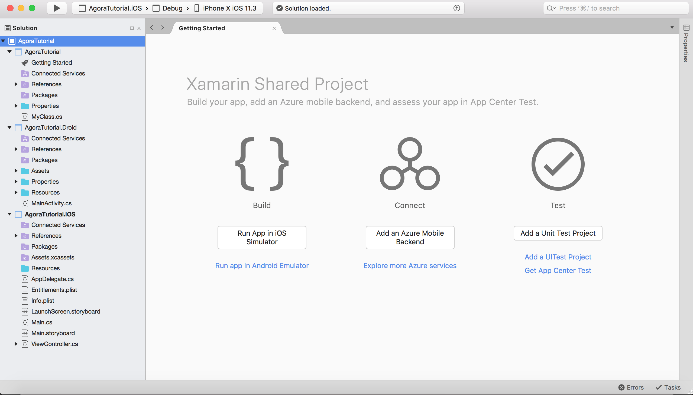
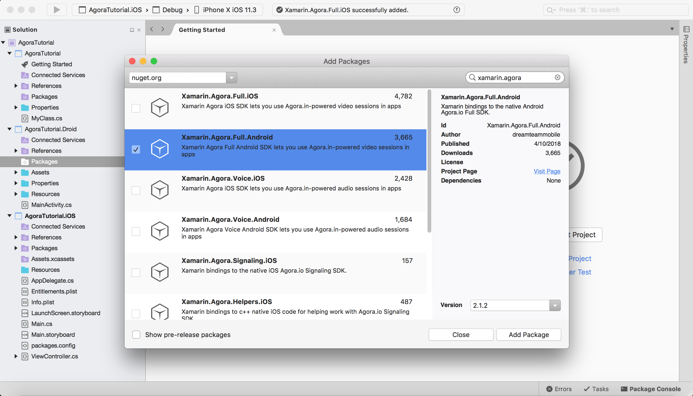

# Agora iOS Tutorial for Swift - 1 to 1

## Prerequisites
- Xamarin, Visual Studio
- Some knowledge of c#
- Agora.io Developer Account

## Agora.io Account
If you haven't already, [create an Agora.io developer account](https://www.dashboard.agora.io/signup). Once you finish the sign up process, you will be redirected to the Dashboard. Feel free to use the sample project's App ID for this tutorial.

## Integrate the Agora SDK
Create a new Blank Native app Solution.




## Add Agora Nuget packages to Android and iOS projects

For AgoraTutorial.Droid project add package [Xamarin.Agora.Full.Android](https://www.nuget.org/packages/Xamarin.Agora.Full.Android/)




or AgoraTutorial.iOS project add package [Xamarin.Agora.Full.iOS](https://www.nuget.org/packages/Xamarin.Agora.Full.iOS/)


## File updates & create UI

In  the `Info.plist` file, make sure to add the Privacy Settings for both the camera and the microphone in order for the device to access them.


Change the file name from `ViewController.cs` to `VideoCallViewController.cs` for a more relevant file name as this will be the view controller we set up for the video call. Next, add a file (`SetChannelViewController.cs`) in order to allow the user to choose which channel to join. We will go ahead and dive into the code for each of these files after we set up the storyboard.


First, download the [assets](assets) provided in this tutorial. These assets are icons for the different buttons added throughout this tutorial. Next, open the `Main.storyboard` file and in the identity inspector, set the custom class to `VideoCallViewController` to update the storyboard VC link with the renamed cs file. Next, drag in a View component for the remote video feed. Inside the remote view, add another view which will be used for the local video feed. This view sits on the top right corner in most video chat applications. Using the same height/width & x/y values, create an image view and assign it the `cameramute.png` asset. This image will be used to overlay the remote video feed when the user pauses their video feed. Afterwards, drag an image view to the center of the local video image view and assign it the `cameraoff_mainVideo.png` image. Add another image view with the same `cameraoff_mainVideo.png` image and center it in the middle of the remote view. On the bottom of the screen, create a view which encapsulates four buttons: Pause Video, Audio Mute, Switch Camera, and Hang Up. Use the appropriate assets for each button and refer to the image above for placement. Lastly, add a segue (`exitCall`) from `VideoCallViewController` to `SetChannelViewController` which will be called to end the video call once the user has pressed the Hang Up button.


Next, drag a View Controller in the `Main.storyboard` file. Add a text field for the user-inputted channel name and a button to start the video call. In the identity inspector, set the custom class to `SetChannelViewController` in order to link the storyboard VC with the file. Lastly, add a segue (`startCall`) from `SetChannelViewController` to `VideoCallViewController` which will be called to start the call once the user has entered the channel name.

## Add Agora Functionality

### Initialize Agora Native SDK
``` c#
using System;
using DT.Xamarin.Agora;
using Foundation;
using UIKit;

namespace AgoraTutorial.iOS
{
    public partial class VideoCallViewController : UIViewController, IAgoraRtcEngineDelegate
    {
        private AgoraRtcEngineKit agoraKit;
        private string AppID = "Your-App-ID";
        private string channel = ""; //User inputted channel name from VC (steps come later in tutorial)

        public VideoCallViewController(IntPtr handle) : base(handle)
        {
        }

        public override void ViewDidLoad()
        {
            base.ViewDidLoad();
            InitializeAgoraEngine();
        }

        private void InitializeAgoraEngine()
        {
            agoraKit = AgoraRtcEngineKit.SharedEngineWithAppIdAndDelegate(AppID, this);
        }
    }
}
```
`AgoraRtcEngineKit` is the basic interface class of Agora Native SDK. The `AgoraRtcEngineKit` object enables the use of Agora Native SDK's communication functionality. Create a variable that is an `AgoraRtcEngineKit` object make it an implicitly unwrapped optional. Next add interface (`IAgoraRtcEngineDelegate`) to your controller. Next, create a method (`InitializeAgoraEngine()`) that will initialize the `AgoraRtcEngineKit` class as a singleton instance to initialize the service before we use it. In the method call, supply two parameters: `AppId` and `delegate`. Provide your App ID as a String and pass in `self` for the delegate providing the current View Controller (the View Controller controlling the call). The Agora Native SDK uses delegates to inform the application on the engine runtime events (joining/leaving a channel, new participants, etc).  Call the `InitializeAgoraEngine()` method inside the `ViewDidLoad()` method. Lastly, add a String optional (`channel`) for the channel name that will be supplied by the user in a different View Controller that will be built later in this tutorial.

### Enable Video Mode
``` c#
        void SetupVideo()
        {
            agoraKit.EnableVideo();  // Enables video mode.
            agoraKit.SetVideoProfile(VideoProfile.Portrait360P, false); // Default video profile is 360P
        }

        public override void ViewDidLoad()
        {
            base.ViewDidLoad();
            InitializeAgoraEngine();
            SetupVideo();
        }
```
Create a method (`SetupVideo()`) and enable video mode within the method. In this tutorial, we are enabling video mode before entering a channel so the end user will start in video mode. If it is enabled during a call, it switches from audio to video mode. Next, set the video encoding profile to 360p and set the swapWidthAndHeight parameter to false. Passing true would result in the swapping of the width and height of the stream. Each profile includes a set of parameters such as: resolution, frame rate, bitrate, etc. When the device's camera does not support the specified resolution, the SDK automatically chooses a suitable camera resolution, but the encoder resolution still uses the one specified by SetVideoProfile. Afterwards, call `SetupVideo()` in the `ViewDidLoad()` method.

### Join Channel
``` swift
func joinChannel() {
    agoraKit.joinChannel(byKey: nil, channelName: "demoChannel1", info:nil, uid:0) {[weak self] (sid, uid, elapsed) -> Void in
        if let weakSelf = self {
            weakSelf.agoraKit.setEnableSpeakerphone(true)
           UIApplication.shared.isIdleTimerDisabled = true
       }
    }
}
```
At this time, create a function (`joinChannel()`) to let a user join a specific channel. Call the `agoraKit.joinChannel()` function and supply `nil` for the `byKey` and `info` parameters. For the channel name, supply any string (ex: "demoChannel1") and pass in 0 for the UID to allow Agora to chose a random UID for the channel ID. Disable the UI Application's Idle Timer and  enable the speakerphone using the Agora Kit. Users in the same channel can talk to each other, however users using different App IDs cannot call each other (even if they join the same channel). Once this method is called successfully, the SDK will trigger the callbacks. We will not be implimenting them in this tutorial, but they will be a part of our future tutorial series.

### Setup Local Video
``` swift
func setupLocalVideo() {
    let videoCanvas = AgoraRtcVideoCanvas()
    videoCanvas.uid = 0
    videoCanvas.view = localVideo
    videoCanvas.renderMode = .render_Fit
    agoraKit.setupLocalVideo(videoCanvas)
}

override func viewDidLoad() {
    super.viewDidLoad(true);
    initializeAgoraEngine();
    setupVideo();
    setupLocalVideo();   
}
```
Now it's time to create the view for local video feed. Create a function (`setupLocalVideo()`) to initialize the AgoraRtcVideoCanvas object, used for the video stream. There are a few object properties that need to be  properly setup. Set the `uid` property to 0 to allow Agora to chose a random UID for the stream feed. The `view` property should be set to the recently added UIView (`localVideo`). The `renderMode` property should be set to `render_Fit` to ensure that if the video size is different than that of the display window, the video is resized proportionally to fit the window. Then, call  `agoraKit.setupLocalVideo(videoCanvas)` passing in the AgoraRtcVideoCanvas object that was just created. Lastly, call `setupLocalVideo()` in the `viewDidLoad()` method.

### Delegate Methods
``` swift
func rtcEngine(_ engine: AgoraRtcEngineKit!, firstRemoteVideoDecodedOfUid uid:UInt, size:CGSize, elapsed:Int) {
    if (remoteVideo.isHidden) {
        remoteVideo.isHidden = false
    }
    let videoCanvas = AgoraRtcVideoCanvas()
    videoCanvas.uid = uid
    videoCanvas.view = remoteVideo
    videoCanvas.renderMode = .render_Adaptive
    agoraKit.setupRemoteVideo(videoCanvas)
}
func rtcEngine(_ engine: AgoraRtcEngineKit!, didOfflineOfUid uid:UInt, reason:AgoraRtcUserOfflineReason) {
    self.remoteVideo.isHidden = true
}
func rtcEngine(_ engine: AgoraRtcEngineKit!, didVideoMuted muted:Bool, byUid:UInt) {
    remoteVideo.isHidden = muted
    remoteVideoMutedIndicator.isHidden = !muted
}
```
Now it's time to create the view for remote video feed. As before, within the interface builder, add a UIView to the View Controller in Main.storyboard and create an outlet to it within the corresponding View Controller. Once completed, create an extention for the ViewController which extends the `AgoraRtcEngineDelegate`. Call the `rtcEngine()` delegate method with the parameters shown above (`engine: AgoraRtcEngineKit`, `firstRemoteVideoDecodedOfUid uid: UInt`, `size: CGSize`, `elapsed: Int`). This callback is hit when another user is connected and the first remote video frame is received and decoded. Inside this function, show the remoteVideo if it's hidden. Next, initialize the AgoraRtcVideoCanvas object and set the object properties as we did above. Set the `uid` property to 0 to allow Agora to chose a random UID for the stream feed. The `view` property should be set to the recently added UIView (`remoteVideo`). The `renderMode` property should be set to `render_Fit` to once again ensure that a  video size that's different than the display window is proportionally resized to fit the window. Then, call `agoraKit.setupRemoteVideo(videoCanvas)` passing in the AgoraRtcVideoCanvas object that was just created. Next, implement the next `rtcEngine()` delegate method with the parameters  (`engine - AgoraRtcEngineKit`, `didOfflineOfUid uid - UInt`, `reason - AgoraRtcUserOfflineReason`), called when another user leaves the channel.  Within that method, set the `remoteVideo` view to be hidden when a user leaves the call. Lastly, implement the last `rtcEngine()` delegate method (`engine: AgoraRtcEngineKit`, `didVideoMuted muted: UInt`, `byUid: UInt`), called when a remote user pauses their stream.

## Adding Other Functionality

### Adding Channel Choice

In order to allow the user to choose which room they wish to join, you added a simple UI layout consisting of a text field for the channel name input and a button to start the call. Now, just add the text field and button as an outlet and action, respectively. If the text field's text property *is not* empty, call the segue `startCall` to move the user to the `VideoChatViewController` within the IBAction function for the button. If the text field's text property is empty, prompt the user to enter some text for the channel name. Lastly, add the `prepare(for segue:)` function in order to pass along the user inputted channel name to the `VideoChatViewController`.

``` swift
@IBOutlet weak var channelName: UITextField!

@IBAction func startCall(_ sender: UIButton) {
    if (channelName.text?.isEmpty)! {
        self.performSegue(withIdentifier: "startCall", sender: self)
    } else {
        print("Enter Channel Name")
    }
}

override func prepare(for segue: UIStoryboardSegue, sender: Any?) {
    if let viewController = segue.destination as? VideoCallViewController {
        viewController.channel = channelName.text!
    }
}
```

### Video Chat Controls

Create a view (`controlButtons`) that sits on the bottom of the remote view. This view will contain the Hang Up button, Audio Mute button, Video Pause button, and the Switch Camera button.

### Hang Up / End Call
```swift
@IBAction func didClickHangUpButton(_ sender: UIButton) {
    leaveChannel()
}

func leaveChannel() {
    agoraKit.leaveChannel(nil)
    hideControlButtons()
    UIApplication.shared.isIdleTimerDisabled = false
    remoteVideo.removeFromSuperview()
    localVideo.removeFromSuperview()
    agoraKit = nil
}

func hideControlButtons() {
    controlButtons.isHidden = true
}
```
Create a function (`leaveChannel()`) which will enables the user to leave the current video call (channel). Inside the function, call the `agoraKit.leaveChannel` passing in `nil` as the parameter. Next, hide the view (`controlButtons`) containing the bottom buttons. Afterwards, programatically remove both the local & remote video views and set the agoraKit to be `nil` to end the instance of the AgoraRtcEngineKit object. Inside the IBAction for the Hang-Up button, call the `leaveChannel()` function we just created. Lastly, create a function (`hideControlButtons()`) which hides the view which contains the different buttons.

### Audio Mute
```swift
@IBAction func didClickMuteButton(_ sender: UIButton) {
    sender.isSelected = !sender.isSelected
    agoraKit.muteLocalAudioStream(sender.isSelected)
    resetHideButtonsTimer()
}
```
Now it's time to add the mute functionality for the local audio feed. In the IBAction for the Mute button, call the `agoraKit.muteLocalAudioStream()` function passing in `sender.isSelected` as the sole parameter.

### Video Pause
```swift
@IBAction func didClickVideoMuteButton(_ sender: UIButton) {
    sender.isSelected = !sender.isSelected
    agoraKit.muteLocalVideoStream(sender.isSelected)
    localVideo.isHidden = sender.isSelected
    localVideoMutedBg.isHidden = !sender.isSelected
    localVideoMutedIndicator.isHidden = !sender.isSelected
    resetHideButtonsTimer()
}
```
Sometimes, you're sitting in your Barney PJs and you don't want to show your video feed to the rest of your co-workers. Add the ability to the IBAction for the Video button by calling `agoraKit.muteLocalVideoStream()` function passing in `sender.isSelected` as the sole parameter.

### Switch Camera
```swift
@IBAction func didClickSwitchCameraButton(_ sender: UIButton) {
    sender.isSelected = !sender.isSelected
    agoraKit.switchCamera()
    resetHideButtonsTimer()
}
```
Next, enable the user to choose between the front and rear cameras. Inside the IBAction for the camera switch button, call the `agoraKit.switchCamera()` method to add the camera switch functionality.  

### Hide Muted Images
```swift
func hideVideoMuted() {
    remoteVideoMutedIndicator.isHidden = true
    localVideoMutedBg.isHidden = true
    localVideoMutedIndicator.isHidden = true
}
```
Create a function (`hideVideoMuted()`) to hide all the image views that are meant to appear when either the remote or local video feeds are paused. Call this function in the `viewDidLoad()` method to ensure the images are hidden on app startup.

### Setup Buttons
```swift
func setupButtons() {
    perform(#selector(hideControlButtons), with:nil, afterDelay:3)
    let tapGestureRecognizer = UITapGestureRecognizer(target: self, action: #selector(VideoChatViewController.viewTapped))
    view.addGestureRecognizer(tapGestureRecognizer)
    view.isUserInteractionEnabled = true
}

func viewTapped() {
    if (controlButtons.isHidden) {
        controlButtons.isHidden = false;
        perform(#selector(hideControlButtons), with:nil, afterDelay:3)
    }
}
```
To keep the UX in mind, we will be hiding the buttons (more so the view that contains the buttons) after 3 seconds so the user's view does not get clogged. Create a function (`setupButtons`) which calls the `hideControlButtons()` function after 3 seconds. Create a tap gesture recognizer (of type: `UITabGestureRecognizer`) which performs the action of calling the `viewTapped()` function. Add the tap gesture recognizer to the view and enable user interaction for the view.


## Conclusion
There you have it! It just took a few steps to get a video app up and running. If you have any questions, please feel free to reach out via [e-mail](mailto:sid.sharma@agora.io) or give me a shout on [Twitter](https://twitter.com/sidsharma_27).
