# Agora Tutorial for Xamarin.iOS - 1 to 1

## Prerequisites
- [Xamarin iOS and Visual Studio](https://developer.xamarin.com/getting-started-ios/)
- Basic knowledge of C#
- Agora.io Developer Account

## Step 1. Agora.io Account
If you haven't already, [create an Agora.io developer account](https://www.dashboard.agora.io/signup). Once you finish the sign up process, you will be redirected to the Dashboard. Feel free to use the sample project's App ID for this tutorial.

## Step 2. Integrate the Agora SDK
Create a new Blank Native app Solution.

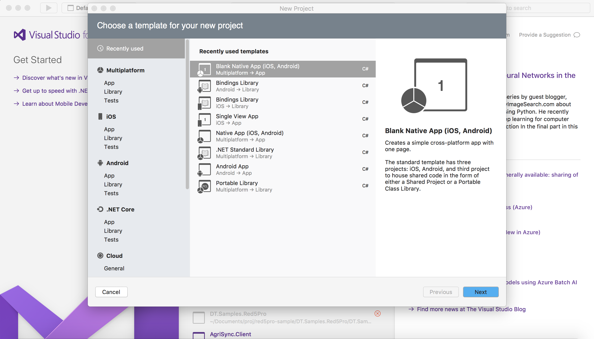

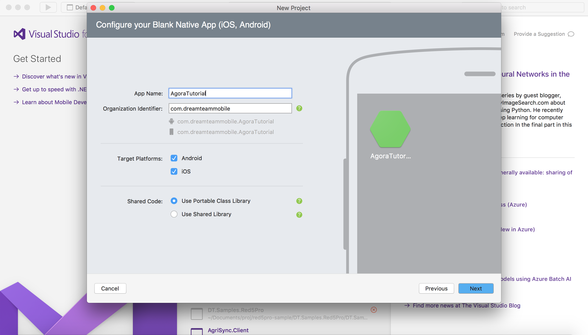

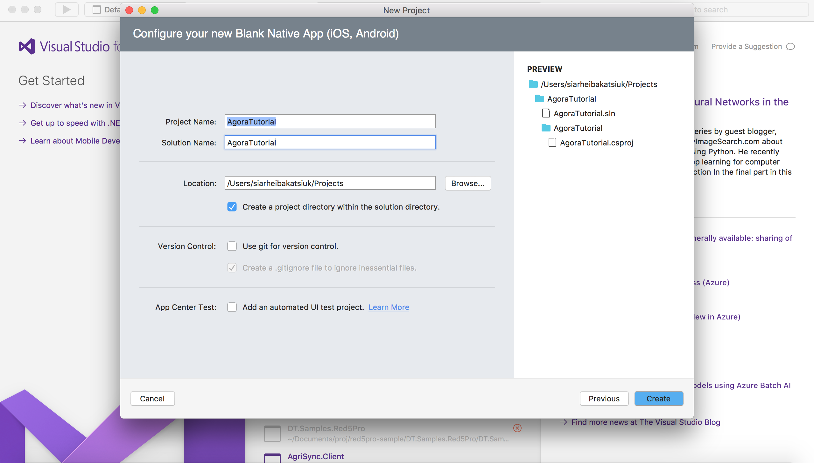

## Step 3. Add Agora Nuget packages to iOS project

For AgoraTutorial.iOS project add package [Xamarin.Agora.Full.iOS](https://www.nuget.org/packages/Xamarin.Agora.Full.iOS/)

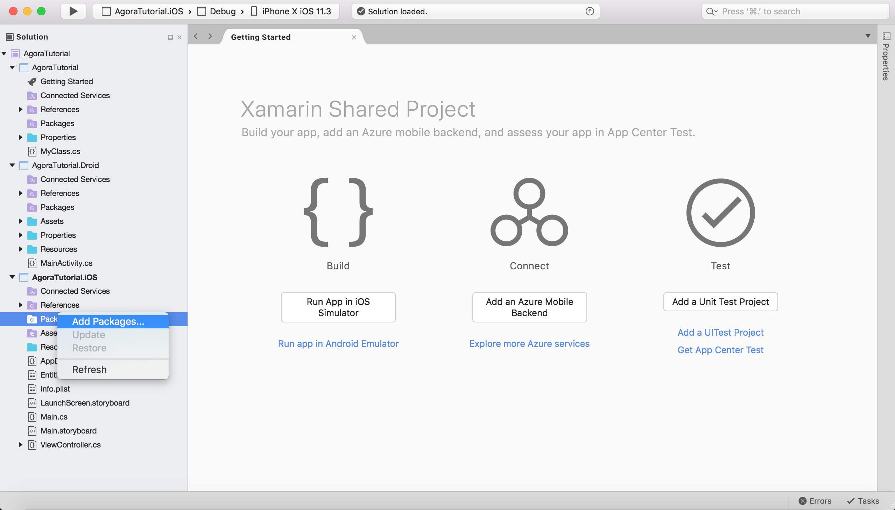

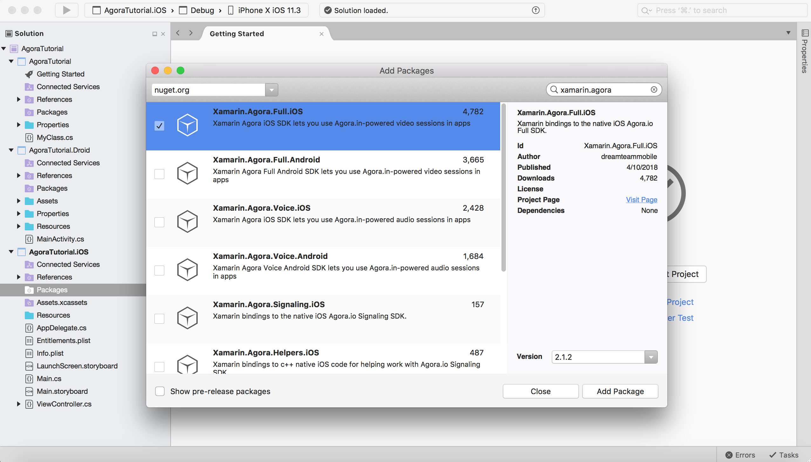

## Step 4. Privacy settings for camera and mic access

In  the `Info.plist` file, make sure to add the Privacy Settings for both the camera and the microphone in order for the device to access them. Also check that minimum iOS version is `9.3`. And verify the project properties build target is `Armv7 + AMD64`, the library does not support `Armv7s` as a target.

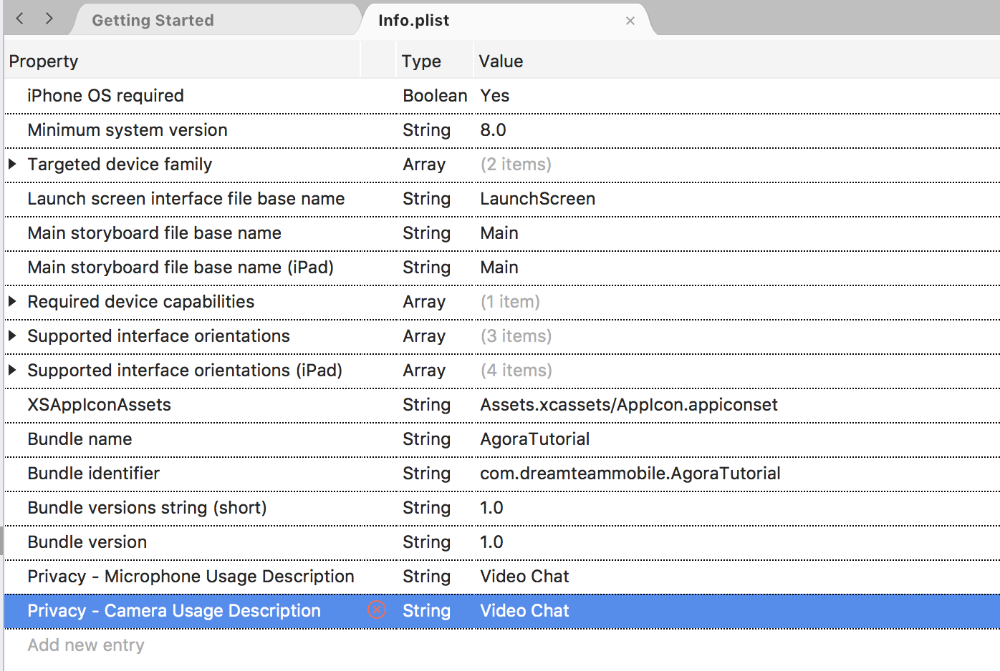

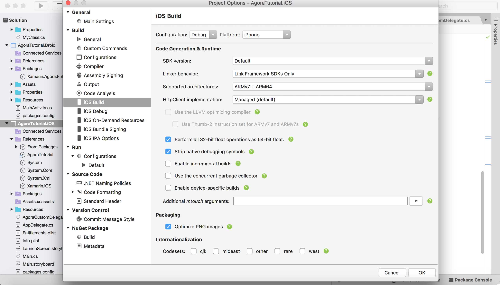

## Step 5. Adding views

First, download the [assets](assets) provided in this tutorial. These assets are icons for the different buttons added throughout this tutorial.
Rename the file from `ViewController.cs` to `VideoCallViewController.cs` for a more relevant file name as this will be the view controller we set up for the video call. Next, add a new view to the project (`SetChannelViewController.cs`) in order to allow the user to choose which channel to join. We will go ahead and dive into the code for each of these files after we set up the storyboard.

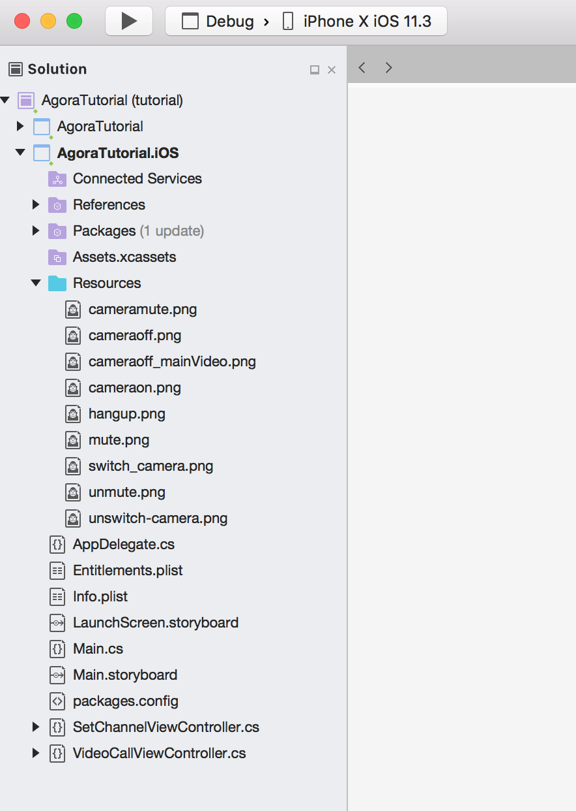

Next, open the `Main.storyboard` file and in the identity inspector, set the custom class to `VideoCallViewController` to update the storyboard VC link with the renamed cs file. Set Storyboard Id to `VideoCallView`. 

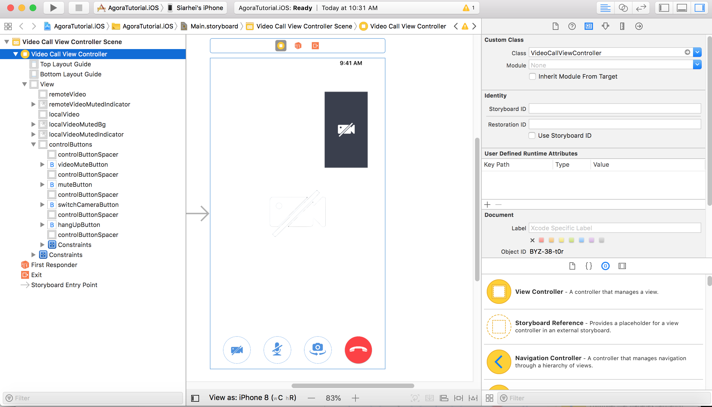

Next, drag in a View component for the remote video feed. Inside the remote view, add another view which will be used for the local video feed. This view sits on the top right corner in most video chat applications. Using the same height/width & x/y values, create an image view and assign it the `cameramute.png` asset. This image will be used to overlay the remote video feed when the user pauses their video feed. Afterwards, drag an image view to the center of the local video image view and assign it the `cameraoff_mainVideo.png` image. 
Add another image view with the same `cameraoff_mainVideo.png` image and center it in the middle of the remote view. On the bottom of the screen, create a view which encapsulates four buttons: Pause Video, Audio Mute, Switch Camera, and Hang Up. Use the appropriate assets for each button and refer to the image above for placement. 

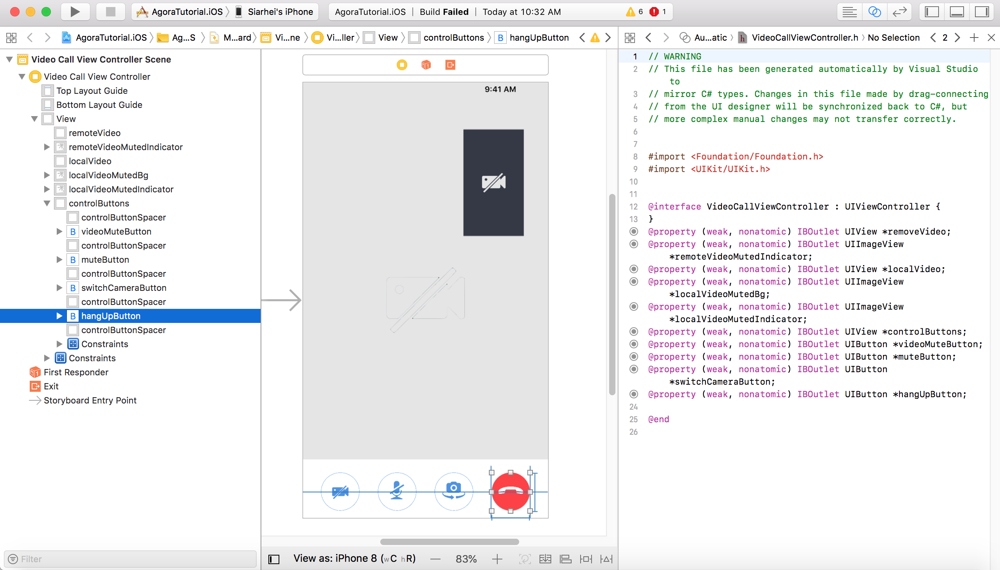

Next, drag a View Controller in the `Main.storyboard` file. Add a text field for the user-inputted channel name and a button to start the video call. In the identity inspector, set the custom class to `SetChannelViewController` in order to link the storyboard VC with the file.

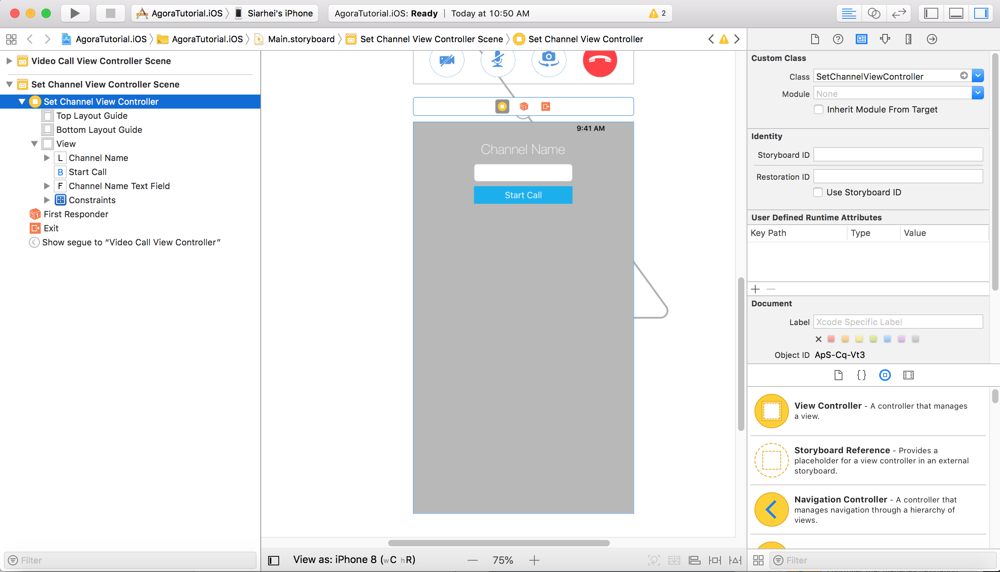

## Step 6. Add Agora Functionality

### Initialize Agora Native SDK
``` c#
using System;
using DT.Xamarin.Agora;
using Foundation;
using UIKit;

namespace AgoraTutorial.iOS
{
    public partial class VideoCallViewController : UIViewController, IAgoraRtcEngineDelegate
    {
        private AgoraRtcEngineKit agoraKit;
        private const string AppID = "Your-App-ID";
        private string channel = ""; //User inputs channel name (steps come later in this tutorial)

        public VideoCallViewController(IntPtr handle) : base(handle)
        {
        }

        public override void ViewDidLoad()
        {
            base.ViewDidLoad();
            InitializeAgoraEngine();
        }

        private void InitializeAgoraEngine()
        {
            agoraKit = AgoraRtcEngineKit.SharedEngineWithAppIdAndDelegate(AppID, this);
        }
    }
}
```
`AgoraRtcEngineKit` is the basic interface class of Agora Native SDK. The `AgoraRtcEngineKit` object enables the use of Agora Native SDK's communication functionality. Create a variable that is an `AgoraRtcEngineKit` object make it an implicitly unwrapped optional. Next add interface (`IAgoraRtcEngineDelegate`) to your controller. Next, create a method (`InitializeAgoraEngine()`) that will initialize the `AgoraRtcEngineKit` class as a singleton instance to initialize the service before we use it. In the method call, supply two parameters: `AppId` and `delegate`. Provide your App ID as a String and pass in `self` for the delegate providing the current View Controller (the View Controller controlling the call). The Agora Native SDK uses delegates to inform the application on the engine runtime events (joining/leaving a channel, new participants, etc).  Call the `InitializeAgoraEngine()` method inside the `ViewDidLoad()` method. Lastly, add a String optional (`channel`) for the channel name that will be supplied by the user in a different View Controller that will be built later in this tutorial.

### Enable Video Mode
``` c#
        void SetupVideo()
        {
            agoraKit.EnableVideo();  // Enables video mode.
            agoraKit.SetVideoProfile(VideoProfile.Portrait360P, false); // Default video profile is 360P
        }

        public override void ViewDidLoad()
        {
            base.ViewDidLoad();
            InitializeAgoraEngine();
            SetupVideo();
        }
```
Create a method (`SetupVideo()`) and enable video mode within the method. In this tutorial, we are enabling video mode before entering a channel so the end user will start in video mode. If it is enabled during a call, it switches from audio to video mode. 
Next, set the video encoding profile to 360p and set the swapWidthAndHeight parameter to false. Passing true would result in the swapping of the width and height of the stream. Each profile includes a set of parameters such as: resolution, frame rate, bitrate, etc. When the device's camera does not support the specified resolution, the SDK automatically chooses a suitable camera resolution, but the encoder resolution still uses the one specified by SetVideoProfile. Afterwards, call `SetupVideo()` in the `ViewDidLoad()` method.

### Join Channel
``` c#
        void JoinChannel()
        {
            agoraKit.JoinChannelByToken(null, "demoChannel1", null, 0, (sid, uid, elapsed) =>
            {
                agoraKit.SetEnableSpeakerphone(true);
                UIApplication.SharedApplication.IdleTimerDisabled = true;
            });
        }
        
        public override void ViewDidLoad()
        {
            base.ViewDidLoad();
            InitializeAgoraEngine();
            SetupVideo();
            JoinChannel();
        }
```
At this time, create a method (`JoinChannel()`) to let a user join a specific channel. Call the `agoraKit.JoinChannelByToken()` method and supply `null` for the `token` and `info` parameters. For the channel name, supply any string (ex: "demoChannel1") and pass in 0 for the UID to allow Agora to chose a random UID for the channel ID. 

Disable the UI Application's Idle Timer and  enable the speakerphone using the Agora Kit. Users in the same channel can talk to each other, however users using different App IDs cannot call each other (even if they join the same channel). Once this method is called successfully, the SDK will trigger the callbacks. We will not be implementing them in this tutorial, but they will be a part of our future tutorial series. Lastly, call `JoinChannel()` in the `ViewDidLoad()` method.

### Setup Local Video
``` c#
        void SetupLocalVideo()
        {
            var videoCanvas = new AgoraRtcVideoCanvas();
            videoCanvas.Uid = 0;
            videoCanvas.View = localVideo;
            videoCanvas.RenderMode = VideoRenderMode.Fit;
            agoraKit.SetupLocalVideo(videoCanvas);
        }

        public override void ViewDidLoad()
        {
            base.ViewDidLoad();
            InitializeAgoraEngine();
            SetupVideo();
            JoinChannel();
            SetupLocalVideo();
        }
```
Now it's time to create the view for local video feed. Create a method (`SetupLocalVideo()`) to initialize the AgoraRtcVideoCanvas object, used for the video stream. There are a few object properties that need to be  properly setup. Set the `Uid` property to 0 to allow Agora to chose a random UID for the stream feed. The `View` property should be set to the recently added UIView (`localVideo`). The `RenderMode` property should be set to `VideoRenderMode.Fit` to ensure that if the video size is different than that of the display window, the video is resized proportionally to fit the window. 

Then, call  `agoraKit.SetupLocalVideo(videoCanvas)` passing in the AgoraRtcVideoCanvas object that was just created. Lastly, call `SetupLocalVideo()` in the `ViewDidLoad()` method.

### Delegate Methods
``` c#
        [Export("rtcEngine:firstRemoteVideoDecodedOfUid:size:elapsed:")]
        public void FirstRemoteVideoDecodedOfUid(AgoraRtcEngineKit engine, nuint uid, CoreGraphics.CGSize size, nint elapsed)
        {
            if (remoteVideo.Hidden)
            {
                remoteVideo.Hidden = false;
            }
            var videoCanvas = new AgoraRtcVideoCanvas();
            videoCanvas.Uid = uid;
            videoCanvas.View = remoteVideo;
            videoCanvas.RenderMode = VideoRenderMode.Adaptive;
            agoraKit.SetupRemoteVideo(videoCanvas);
        }

        [Export("rtcEngine:didOfflineOfUid:reason:")]
        public void DidOfflineOfUid(AgoraRtcEngineKit engine, nuint uid, UserOfflineReason reason)
        {
            remoteVideo.Hidden = true;
        }

        [Export("rtcEngine:didVideoMuted:byUid:")]
        public void DidVideoMuted(AgoraRtcEngineKit engine, bool muted, nuint uid)
        {
            remoteVideo.Hidden = muted;
            remoteVideoMutedIndicator.Hidden = !muted;
        }
```
Now it's time to create the view for remote video feed. As before, within the interface builder, add a UIView to the View Controller in Main.storyboard and create an outlet to it within the corresponding View Controller. 
Once completed, create an extention for the ViewController which extends the `IAgoraRtcEngineDelegate`. Add the `FirstRemoteVideoDecodedOfUid` delegate method with the parameters shown above (`AgoraRtcEngineKit engine, nuint uid, CoreGraphics.CGSize size, nint elapsed`). 
This callback is hit when another user is connected and the first remote video frame is received and decoded. Inside this method, show the remoteVideo if it's hidden. 

Next, initialize the AgoraRtcVideoCanvas object and set the object properties as we did above. Set the `Uid` property to 0 to allow Agora to chose a random UID for the stream feed. The `View` property should be set to the recently added UIView (`remoteVideo`). The `RenderMode` property should be set to `VideoRenderMode.Adaptive` to once again ensure that a  video size that's different than the display window is proportionally resized to fit the window. 

Then, call `agoraKit.SetupRemoteVideo(videoCanvas)` passing in the AgoraRtcVideoCanvas object that was just created. Next, implement the next `DidOfflineOfUid` delegate method with the parameters  (`AgoraRtcEngineKit engine, nuint uid, UserOfflineReason reason`), called when another user leaves the channel.  Within that method, set the `remoteVideo` view to be hidden when a user leaves the call. Lastly, implement the last `DidVideoMuted` delegate method (`AgoraRtcEngineKit engine, bool muted, nuint uid`), called when a remote user pauses their stream.

## Step 7. Adding Other Functionality

### Adding Channel Choice

In order to allow the user to choose which room they wish to join, you added a simple UI layout consisting of a text field for the channel name input and a button to start the call. Open the `Main.storyboard` file and set `SetChannelViewController` as an `Initial View Controller`. Now, just add the text field and button as an outlet and action, respectively. If the text field's text property *is not* empty, show `VideoCallViewController` within the IBAction function for the button. If the text field's text property is empty, prompt the user to enter some text for the channel name. Lastly,  pass the user inputted channel name to the `VideoCallViewController`.

``` c#
        partial void StartCallClick(NSObject sender)
        {
            if (string.IsNullOrWhiteSpace(channelNameTextField.Text))
            {
                channelName.Text = "Please input channel name to proceed";
            }
            else
            {
                var storyboard = UIStoryboard.FromName("Main", null);
                var controller = storyboard.InstantiateViewController("VideoCallView");
                VideoCallViewController.Channel = channelNameTextField.Text;
                this.ShowViewController(controller, this);
            }
        }
```
Update your JoinChannel method in `VideoCallViewController` to use `Channel` field recieved from channel input screen.

``` c#
        void JoinChannel()
        {
            agoraKit.JoinChannelByToken(null, Channel, null, 0, (sid, uid, elapsed) =>
            {
                agoraKit.SetEnableSpeakerphone(true);
                UIApplication.SharedApplication.IdleTimerDisabled = true;
            });
        }
```
### Video Chat Controls

Create a view (`controlButtons`) that sits on the bottom of the remote view. This view will contain the Hang Up button, Audio Mute button, Video Pause button, and the Switch Camera button.

### Hang Up / End Call
``` c#
        partial void HangUpButtonClick(NSObject sender)
        {
            LeaveChannel();
        }

        void LeaveChannel()
        {
            agoraKit.LeaveChannel(null);
            HideControlButtons();
            UIApplication.SharedApplication.IdleTimerDisabled = false;
            remoteVideo.RemoveFromSuperview();
            localVideo.RemoveFromSuperview();
            agoraKit = null;
            this.DismissViewController(true, null);
        }

        void HideControlButtons()
        {
            controlButtons.Hidden = true;
        }
```
Create a method `LeaveChannel()` which will enables the user to leave the current video call (channel). Inside the method, call the `agoraKit.LeaveChannel` passing in `null` as the parameter. Next, hide the view (`controlButtons`) containing the bottom buttons. Afterwards, programatically remove both the local & remote video views and set the agoraKit to be `null` to end the instance of the AgoraRtcEngineKit object. Inside the IBAction for the Hang-Up button, call the `LeaveChannel()` method we just created. Lastly, create a method `HideControlButtons()` which hides the view which contains the different buttons.

### Audio Mute
```c#
        partial void MuteButtonClick(NSObject sender)
        {
            var button = (UIButton)sender;
            button.Selected = !button.Selected;
            agoraKit.MuteLocalAudioStream(button.Selected);
        }
```
Now it's time to add the mute functionality for the local audio feed. In the IBAction for the Mute button, call the `agoraKit.MuteLocalAudioStream()` method passing in `button.Selected` as the sole parameter.

### Video Pause
```c#
        partial void VideoMuteButtonClick(NSObject sender)
        {
            var button = (UIButton)sender;
            button.Selected = !button.Selected;
            agoraKit.MuteLocalVideoStream(button.Selected);
            localVideo.Hidden = button.Selected;
            localVideoMutedBg.Hidden = !button.Selected;
            localVideoMutedIndicator.Hidden = !button.Selected;
        }
```
Sometimes, you're sitting in your Barney PJs and you don't want to show your video feed to the rest of your co-workers. Add the ability to the IBAction for the Video button by calling `agoraKit.MuteLocalVideoStream()` method passing in `button.Selected` as the sole parameter.

### Switch Camera
```c#
        partial void SwitchCameraButtonClick(NSObject sender)
        {
            var button = (UIButton)sender;
            button.Selected = !button.Selected;
            agoraKit.SwitchCamera();
        }
```
Next, enable the user to choose between the front and rear cameras. Inside the IBAction for the camera switch button, call the `agoraKit.SwitchCamera()` method to add the camera switch functionality.  

### Hide Muted Images
```c#
        void HideVideoMuted()
        {
            remoteVideoMutedIndicator.Hidden = true;
            localVideoMutedBg.Hidden = true;
            localVideoMutedIndicator.Hidden = true;
        }
```
Create a method `HideVideoMuted()` to hide all the image views that are meant to appear when either the remote or local video feeds are paused. Call this method in the `ViewDidLoad()` method to ensure the images are hidden on app startup.

### Setup Buttons
```c#
        void SetupButtons()
        {
            var tapGestureRecognizer = new UITapGestureRecognizer(ViewTapped);
            View.AddGestureRecognizer(tapGestureRecognizer);
            View.UserInteractionEnabled = true;
        }
        
        public override void ViewDidLoad()
        {
            base.ViewDidLoad();
            InitializeAgoraEngine();
            SetupVideo();
            JoinChannel();
            SetupLocalVideo();
            HideVideoMuted();
            SetupButtons();
        }
```
To keep the UX in mind, we will be hiding/showing the buttons (more so the view that contains the buttons) when user clicked on View. Create a method (`SetupButtons`) and inside it create a tap gesture recognizer (of type: `UITapGestureRecognizer`) which performs the action of calling the `ViewTapped()` method. Add the tap gesture recognizer to the view and enable user interaction for the view. 


## Conclusion
There you have it! It just took a few steps to get a video app up and running. If you have any questions, please feel free to reach out via [e-mail](mailto:videocalls@dreamteam-mobile.com).
